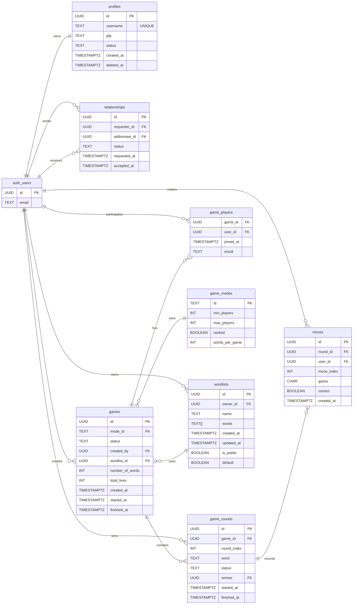

```mermaid
erDiagram
    direction LR
    auth_users {
        UUID id PK
        TEXT email
    }

    profiles {
        UUID id PK
        TEXT username "UNIQUE"
        TEXT pfp
        TEXT status
        TIMESTAMPTZ created_at
        TIMESTAMPTZ deleted_at
    }

    relationships {
        UUID id PK
        UUID requester_id FK
        UUID addressee_id FK
        TEXT status
        TIMESTAMPTZ requested_at
        TIMESTAMPTZ accepted_at
    }

    games {
        UUID id PK
        TEXT mode_id FK
        TEXT status
        UUID created_by FK
        UUID wordlist_id FK
        INT number_of_words
        INT total_lives
        TIMESTAMPTZ created_at
        TIMESTAMPTZ started_at
        TIMESTAMPTZ finished_at
    }

    game_rounds {
        UUID id PK
        UUID game_id FK
        INT round_index
        TEXT word
        TEXT status
        UUID winner FK
        TIMESTAMPTZ started_at
        TIMESTAMPTZ finished_at
    }

    game_players {
        UUID game_id FK
        UUID user_id FK
        TIMESTAMPTZ joined_at
        TEXT result
    }

    moves {
        UUID id PK
        UUID round_id FK
        UUID user_id FK
        INT move_index
        CHAR guess
        BOOLEAN correct
        TIMESTAMPTZ created_at
    }

    game_modes {
        TEXT id PK
        INT min_players
        INT max_players
        BOOLEAN ranked
        INT words_per_game
    }

    wordlists {
        UUID id PK
        UUID owner_id FK
        TEXT name
        TEXT[] words
        TIMESTAMPTZ created_at
        TIMESTAMPTZ updated_at
        BOOLEAN is_public
        BOOLEAN default
    }


    auth_users ||--|| profiles : owns
    auth_users ||--o{ relationships : sends
    auth_users ||--o{ relationships : receives

    auth_users ||--o{ games : creates
    auth_users ||--o{ wordlists : owns
    auth_users ||--o{ game_players : participates
    auth_users ||--o{ moves : makes
    auth_users ||--o{ game_rounds : wins

    games ||--o{ game_players : has
    games ||--o{ game_rounds : contains
    game_rounds ||--o{ moves : records

    games }o--|| game_modes : uses
    games }o--|| wordlists : uses
```
